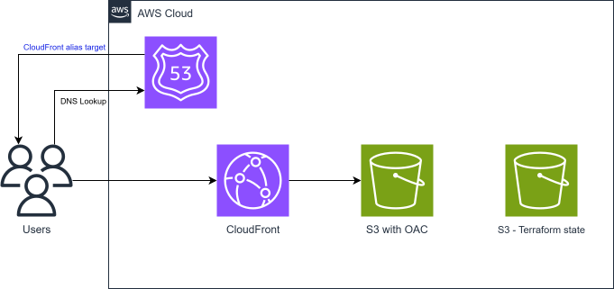

# Portfolio Website – Nam Son

## 🌐 Overview
My personal **portfolio website** built with **React, TypeScript, and Tailwind CSS**, hosted on AWS via S3 + CloudFront with Terraform automation.

👉 [Live Site](https://namson.io)

---

## 🖥️ Frontend
- **Stack**: React, TypeScript, Tailwind CSS, Vite.
- **Design**: Responsive, animated UI with dark/light theme.
- **Features**:
  - Profile, About, Skills, Project, Experience, and Contact sections.
  - Resume download button.
  - Responsive navbar with hamburger menu.

---

## ☁️ Infrastructure (Terraform + AWS)

### S3 + CloudFront Hosting


- **S3 bucket** with OAC (no public access).
- **CloudFront** for global CDN, SSL termination, and caching.
- **ACM** integrated with CloudFront for HTTPS.
- **Route 53** alias to CloudFront.
- **Terraform** provisions everything with remote state in S3.

> Chosen for reliability, scalability, and cost efficiency as the production hosting solution.

---

## ⚙️ CI/CD (GitHub Actions)
- **CI Build Test**: Lints and validates the build.
- **CD to S3**: Builds the Vite app and syncs to S3 with cache control headers and CloudFront invalidation.

---

## 📂 Repository Structure
```
.github/workflows/    # CI/CD pipelines
infra/
├─ S3_prod/           # Terraform config for S3 + CloudFront
└─ modules/           # Shared Terraform modules (S3, CloudFront, Route 53)
app/
├─ src/               # React source code
├─ public/            # Static assets (SVG diagrams, resume)
└─ package.json
```

---

## 🚀 How to Run Locally
```bash
git clone https://github.com/PhamNamSon/portfolio.git
cd portfolio/app
npm install
npm run dev
```
Visit: http://localhost:5173

Or with Docker:
```bash
docker build -t portfolio .
docker run -p 8080:80 portfolio
```
Visit: http://localhost:8080

---

## 📖 Lessons Learned
- Designing a production-grade static hosting setup with S3 + CloudFront.
- Managing Terraform state in S3 for consistency.
- Building modular Terraform for reusable components.
- Handling cache invalidation in CloudFront.
- Building responsive React UIs with dark/light theme support.